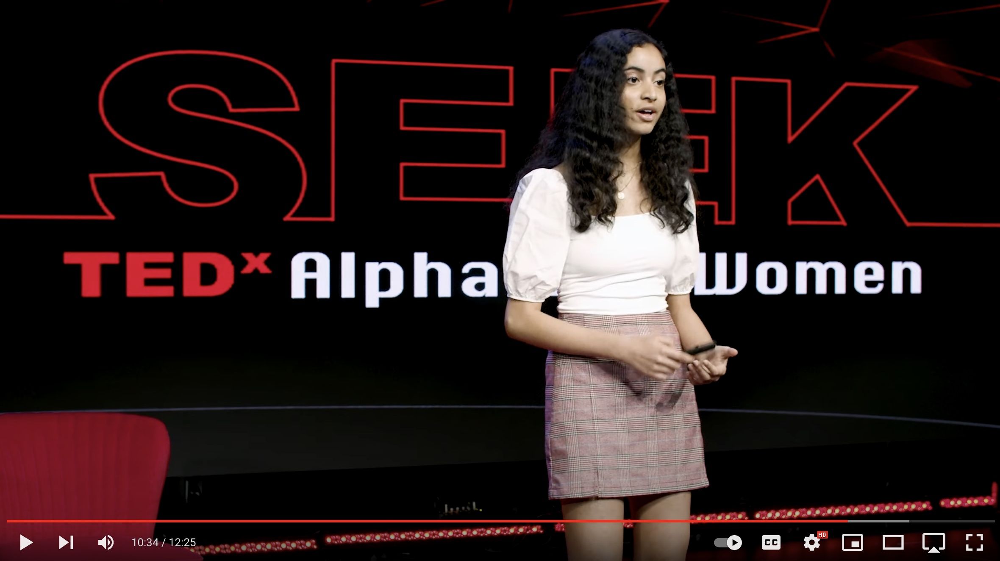

Click each title link to see a project demo video, code hosted on GitHub, and other information.

---
title: "iSense - AI-Based Model and App to Predict Depressive and Destructive Sentiment"
excerpt: "Mobile application powered by an Artificial Intelligence model to securely identify linguistic biomarkers of mood disorders in a teen’s outgoing SMS messages "
collection: portfolio
---

The prevalence of mood disorders has increased rapidly over the past decade, especially in teens. This study proposes a mobile application (iSense) powered by an Artificial Intelligence model to identify linguistic biomarkers of mood disorders in a teen’s outgoing SMS messages and send notifications to a parent. The Twitter API was used to create a dataset of over 800 individuals whose language use indicates a mood disorder, based on the DSM-5 Diagnostic Criteria for depressive disorders, and individuals with a healthy mental state. Millions of tweets were collected from these users and filtered to 73,944 tweets based on tweet length (over 50 characters) and dropping retweets. After conducting linguistic analysis, the tweets were used to train/test a generalized linear lasso model (hyperplane-based approach), gradient boosting machine (tree-based approach), and feed-forward multilayer perceptron (neural network-based approach).  These models were then compared on several measures such as F1 Score (max 0.717) and accuracy (max 86%).  Other features such as notification preferences (parent interface) and a voice-enabled chatbot (child interface) were implemented in the mobile application.  iSense has the potential to enable early detection of mood disorders and at-risk individuals, providing a viable solution to combat the increase in suicide cases.

_Related Awards: International Science and Engineering Fair 1st Place Special Award & 4th Place Grand Award, Congressional App Challenge Winner_

[Code on GitHub](https://github.com/divnori/iSense)

